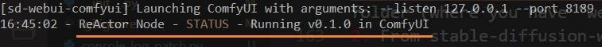
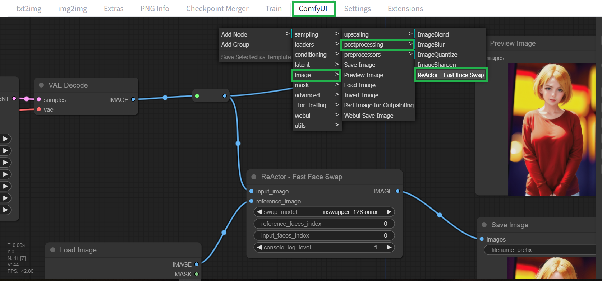

# ReActor Node 0.2.0-beta1 for ComfyUI
### The Fast and Simple "roop-like" Face Swap Extension Node for ComfyUI, based on [ReActor (ex Roop-GE)](https://github.com/Gourieff/sd-webui-reactor) SD-WebUI Face Swap Extension

> This Node goes without NSFW filter (uncensored, use it on your own responsibility) 

---
[**Disclaimer**](#disclaimer) | [**Installation**](#installation) | [**Usage**](#usage) | [**Troubleshooting**](#troubleshooting) | [**Updating**](#updating)

---

### Disclaimer

This software is meant to be a productive contribution to the rapidly growing AI-generated media industry. It will help artists with tasks such as animating a custom character or using the character as a model for clothing etc.

The developers of this software are aware of its possible unethical applicaitons and are committed to take preventative measures against them. We will continue to develop this project in the positive direction while adhering to law and ethics.

Users of this software are expected to use this software responsibly while abiding the local law. If face of a real person is being used, users are suggested to get consent from the concerned person and clearly mention that it is a deepfake when posting content online. **Developers and Contributors of this software are not responsible for actions of end-users.**

## Installation

[SD WebUI](#sdwebui) | [Standalone ComfyUI](#standalone)

<a name="sdwebui">If you use [AUTOMATIC1111](https://github.com/AUTOMATIC1111/stable-diffusion-webui/) or [SD.Next](https://github.com/vladmandic/automatic)

1. Close (stop) your SD-WebUI/Comfy Server if it's running
2. (For Windows Users) Install [Visual Studio 2022](https://visualstudio.microsoft.com/downloads/) (Community version - you need this step to build Insightface) -OR- only [VS C++ Build Tools](https://visualstudio.microsoft.com/visual-cpp-build-tools/) and select "Desktop Development with C++" under "Workloads -> Desktop & Mobile" -OR- if you don't want to install VS or VS C++ BT - follow [this steps (sec. I)](#insightfacebuild)
3. Go to the `extensions\sd-webui-comfyui\ComfyUI\custom_nodes`
4. Open Console or Terminal and run `git clone https://github.com/Gourieff/comfyui-reactor-node`
5. Go to the SD WebUI root folder, open Console or Terminal and run (Windows users)`.\venv\Scripts\activate` or (Linux/MacOS)`venv/bin/activate`
6. `python -m pip install -U pip`
7. `cd extensions\sd-webui-comfyui\ComfyUI\custom_nodes\comfyui-reactor-node`
8. `python install.py`
9. Please, wait until the installation process will be finished
10. Run SD WebUI and check console for the message that ReActor Node is running:

11. Go to the ComfyUI tab and find there ReActor Node inside the menu `image/postprocessing` or by using a search:

12. Enjoy!

<a name="standalone">If you use Standalone [ComfyUI](https://github.com/comfyanonymous/ComfyUI) for Windows

1. Go to the `ComfyUI\custom_nodes` directory
2. Open Console and run `git clone https://github.com/Gourieff/comfyui-reactor-node`
3. Run install.bat
4. Run ComfyUI and find there ReActor Node inside the menu `image/postprocessing` or by using a search

## Usage

Just connect all required nodes and run the query

## Troubleshooting

<a name="insightfacebuild">**I. (For Windows users) If you still cannot build Insightface for some reasons or just don't want to install Visual Studio or VS C++ Build Tools - do the following:**

1. Download and put [prebuilt Insightface package](https://github.com/Gourieff/sd-webui-reactor/raw/main/example/insightface-0.7.3-cp310-cp310-win_amd64.whl) into the stable-diffusion-webui (A1111 or SD.Next) root folder (where you have "webui-user.bat" file) or into ComfyUI root folder if you use ComfyUI Portable
2. From the root folder run:
   - (SD WebUI) CMD and `.\venv\Scripts\activate`
   - (ComfyUI Portable) run CMD
3. Then update your PIP:
   - (SD WebUI) `python -m pip install -U pip`
   - (ComfyUI Portable) `python_embeded\python.exe -m pip install -U pip`
4. Then install Insightface:
   - (SD WebUI) `pip install insightface-0.7.3-cp310-cp310-win_amd64.whl`
   - (ComfyUI Portable) `python_embeded\python.exe -m pip install insightface-0.7.3-cp310-cp310-win_amd64.whl`
5. Enjoy!

## Updating

Just put .bat or .sh script from this [Repo](https://github.com/Gourieff/sd-webui-extensions-updater) to the `ComfyUI\custom_nodes` directory and run it when you need to check for updates
